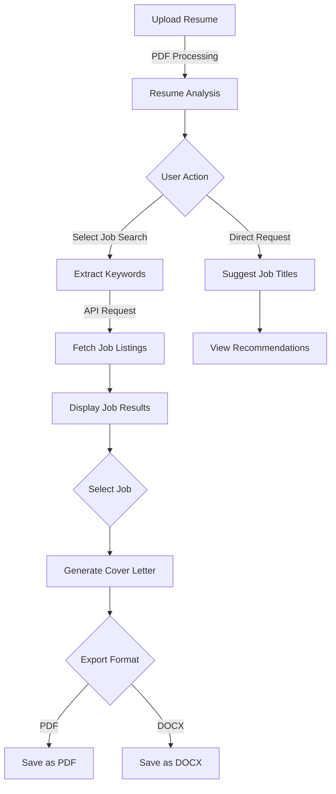

# CareerAgent - AI-Powered Job Search Assistant

*Created for Quira Quest 25 by Chaitanya Sharma*


## 🤖 Quira Quest 25 Submission

This project was created for the Quira Quest 25 challenge focusing on AI agents. CareerAgent demonstrates how LLMs can be used with agentic frameworks to create practical, real-world applications that help users accomplish complex tasks through a coherent workflow.

### 🏆 Quest Requirements Met

- **Framework Used**: Built with LangChain, one of the recommended frameworks
- **Agent Structure**: 
  - Clear instructions via system message
  - Comprehensive toolbox for job search tasks
  - Sequential workflow for job application process
- **Integration**: Connects with Jooble API for real job listings
- **Practical Use**: Solves a real-world problem (job searching and application)

## 📌 Overview

CareerAgent is an AI-powered job assistant that helps job seekers streamline their job search process. Using Google's Gemini AI and the LangChain framework, this tool:

1. Analyzes your resume
2. Suggests suitable job titles
3. Finds matching job listings via API integration
4. Generates tailored cover letters for specific jobs

The agent uses conversational AI, tool usage, and a structured workflow to guide users through the entire job application process.

## ✨ Key Features

- **Resume Analysis**: Extracts and analyzes PDF resumes to identify skills, experience, and education
- **Job Title Suggestions**: Recommends suitable job titles based on your resume content
- **Keyword Extraction**: Automatically identifies the most relevant keywords for job searching
- **Job Search Integration**: Searches real job listings through the Jooble API
- **Cover Letter Generation**: Creates professionally tailored cover letters for specific job listings
- **Document Export**: Saves cover letters as PDF or DOCX files

## 🧠 Agent Architecture

CareerAgent demonstrates an agentic design pattern with:

- **System Instructions**: Defined purpose and capabilities
- **Tool Integration**: Well-defined tools that accomplish specific tasks
- **Sequential Workflows**: Multi-step processes to complete complex tasks
- **API Integration**: Connection to external services for real-world data
- **Memory Management**: Conversation state tracking for contextual responses

### LangChain Components Used:

- `AgentExecutor` and `AgentType.CHAT_CONVERSATIONAL_REACT_DESCRIPTION`
- `Tool` and custom tool definitions
- `ConversationBufferMemory` for dialogue history
- `PromptTemplate` for structured prompts
- `LLMChain` and `SequentialChain` for multi-step reasoning

## 🔄 Workflow



## 🚀 Technology Stack

- **Python**: Core programming language
- **LangChain**: Agent framework for connecting LLMs with tools
- **Google Generative AI (Gemini)**: LLM for text generation and analysis
- **Streamlit**: Web application framework
- **PyMuPDF**: PDF text extraction
- **Jooble API**: Job listings data source
- **python-docx & pdfkit**: Document generation

## 📋 Prerequisites

- Python 3.8+
- Google Gemini API key
- Jooble API key

## 💻 Installation

1. Clone this repository
2. Install the required dependencies:
   ```
   pip install langchain langchain_google_genai streamlit pymupdf requests python-docx pdfkit
   ```
3. Configure your API keys:
   ```python
   export GOOGLE_API_KEY="your_google_api_key"
   export JOOBLE_API_KEY="your_jooble_api_key"
   ```

## 📺 Demo Video

[](https://www.youtube.com/watch?v=S4ZPeb96LGw "Watch CareerAgent Demo")

*Click on the image above to watch the demo video on YouTube*

## 🏃‍♂️ Running the Application

Run the refactored agent that uses the LangChain framework:

```
streamlit run main.py
```

## 📈 How to Use

1. **Upload Resume**: Start by uploading your resume in PDF format
2. **Automated Job Search**: Search for jobs using keywords or let the agent extract keywords from your resume
3. **Browse Job Listings**: View job listings fetched from Jooble API
4. **Generate Cover Letters**: Create tailored cover letters for specific jobs
5. **Save Documents**: Export cover letters as PDF or DOCX files

## 🧪 Agent Capabilities in Detail

- **Resume Analysis**: 
  ```python
  analyze_resume(resume_text: str, query: str) -> str
  ```
  Analyzes resume content based on specific user queries.

- **Job Title Suggestions**:
  ```python
  suggest_job_titles(resume_text: str) -> str
  ```
  Suggests the top 5 most suitable job titles based on resume content.

- **Keyword Extraction**:
  ```python 
  extract_keywords(resume_text: str) -> List[str]
  ```
  Identifies the most relevant keywords for job searching.

- **Job Search**:
  ```python
  search_jobs(query: str) -> Dict
  ```
  Searches for jobs through the Jooble API.

- **Cover Letter Generation**:
  ```python
  generate_cover_letter(resume_text: str, job_info: str) -> str
  ```
  Creates tailored cover letters for specific job listings.

## 🛠️ Project Structure

- `refactored_agent.py`: Main application with LangChain agent implementation
- `google_agent.py`: Original version of the application
- `README.md`: Project documentation
- `cover_letters/`: Directory containing generated cover letters

## 🔍 What Makes This an Agent?

This project demonstrates key agent properties:

1. **Autonomy**: Makes decisions about job matches and cover letter content
2. **Tool Use**: Leverages multiple tools to accomplish different steps
3. **Goal-Oriented**: Focuses on the end goal of job application assistance
4. **Memory**: Maintains context through conversation
5. **Workflow**: Handles multi-step processes from resume analysis to cover letter creation

## 📝 Future Enhancements

- Integration with more job search APIs
- Resume improvement suggestions
- Interview preparation assistance
- Application tracking system

## ⚠️ Disclaimer

The API keys in the code should be replaced with your own keys. In production, always use environment variables for sensitive information.

---

Created by Chaitanya Sharma for Quira Quest 25, April 2025
